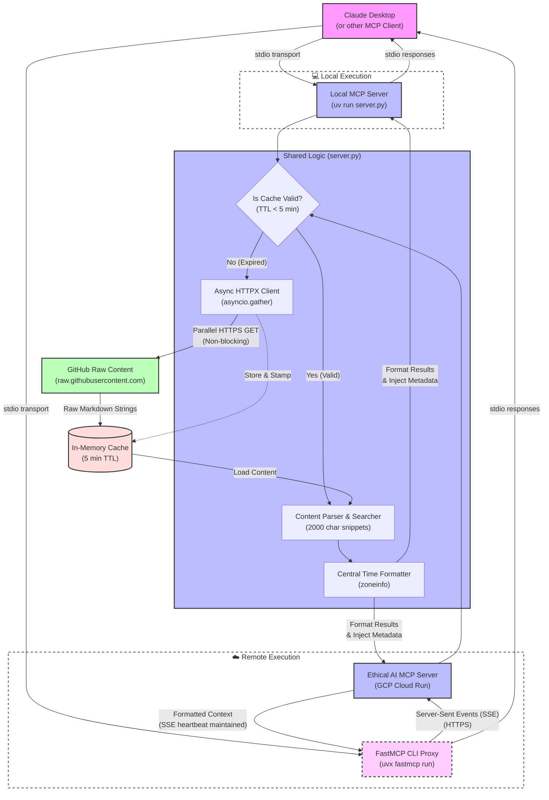

# Ethical AI MCP Server

This directory contains the Model Context Protocol (MCP) server for the `learning-ethical-ai` repository. 
It exposes the repository's 2026 AI Ethics guidelines, healthcare checklists, and agentic safety frameworks as queryable resources, tools, and prompts for your AI assistant.

## Prerequisites

- Python 3.11+
- `uv` (recommended) or `pip`

## Quick Start (Running locally)

The easiest way to run the server is using `uv`. We have configured `server.py` with inline dependencies so `uv` will automatically download Python 3.11+ and the `mcp` SDK if you don't have them.

```bash
cd 08-mcp-server

# Run the MCP Server Inspector
npx @modelcontextprotocol/inspector uv run server.py
```

> [!IMPORTANT]
> **If using the Inspector web UI**, ensure your connection settings are:
> - **Command**: `uv`
> - **Arguments**: `run server.py`
> 
> *(Do not use `python` as the command, as your system Python may be older than 3.11 and lack the `mcp` package!)*

## ☁️ Google Cloud Run Deployment

This server is packaged as a standard Docker container that leverages `fastmcp`'s SSE (Server-Sent Events) transport. This allows it to run seamlessly on a publicly accessible HTTPS endpoint hosted by GCP Cloud Run without configuring web sockets.

The live production endpoint for this demo is:
```
https://ethical-ai-mcp-[YOUR_PROJECT_HASH].us-central1.run.app/sse
```

### 🔌 Connecting Claude Desktop to Cloud Run
To test the live cloud server, add the following configuration to your `claude_desktop_config.json`:

#### macOS: `~/Library/Application Support/Claude/claude_desktop_config.json`
#### Windows: `%APPDATA%\Claude\claude_desktop_config.json`

```json
{
  "mcpServers": {
    "learning-ethical-ai": {
      "command": "uvx",
      "args": [
        "fastmcp",
        "run",
        "https://ethical-ai-mcp-[YOUR_PROJECT_HASH].us-central1.run.app/sse"
      ]
    }
  }
}
```

> **Note:** The native `fastmcp run` client translates the remote SSE web stream back into standard `stdio` formats that Claude Desktop understands locally.

Restart Claude Desktop, and you will see the `learning-ethical-ai` tools and resources populated in your interface, powered entirely from the cloud!

## Adding to Claude Desktop

To use this server with Claude Desktop, add the following configuration to your `claude_desktop_config.json` file:

**macOS**: `~/Library/Application Support/Claude/claude_desktop_config.json`
**Windows**: `%APPDATA%\Claude\claude_desktop_config.json`

```json
{
  "mcpServers": {
    "ethical-ai": {
      "command": "uv",
      "args": [
        "run",
        "--with",
        "mcp",
        "python",
        "/absolute/path/to/learning-ethical-ai/08-mcp-server/server.py"
      ]
    }
  }
}
```

*Replace `/absolute/path/to/learning-ethical-ai` with the actual absolute path to your repository clone.*

## Architecture

Our server operates on a stateless architecture, utilizing an in-memory cache and Python `concurrent.futures.ThreadPoolExecutor` to automatically fetch the most current guidelines directly from the GitHub repository:



## Features

- **Resources**: Instantly loads `eu-ai-act-checklist.md`, `hipaa-ai-checklist.md`, and `mcp-security-threats.md` directly into the AI's context.
- **Tools**:
  - `search_guidelines`: Searches all markdown docs in the repo.
  - `get_learning_path`: Fetches role-specific advice.
  - `get_tool_configuration`: Digs up Python configurations for tools like `giskard`.
- **Prompts**: One-click actions to Audit Agent Security and Review Healthcare Compliance based on the repo's guidelines.
